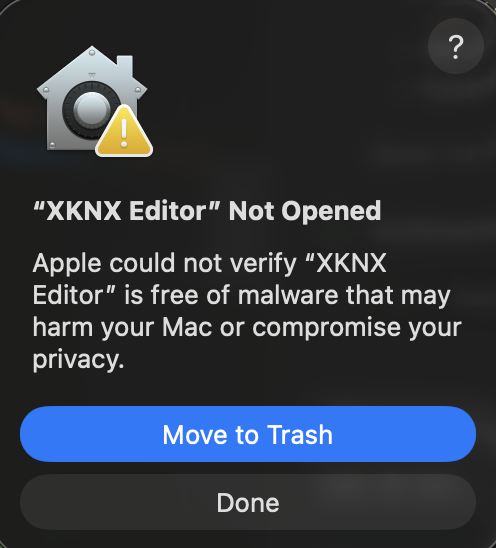
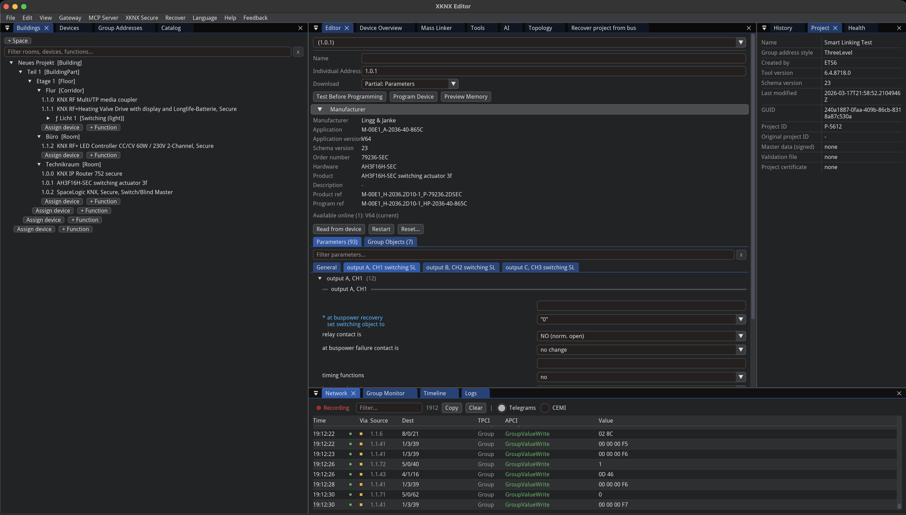
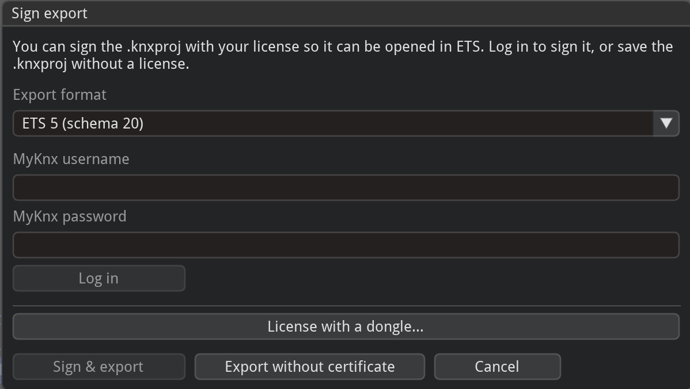
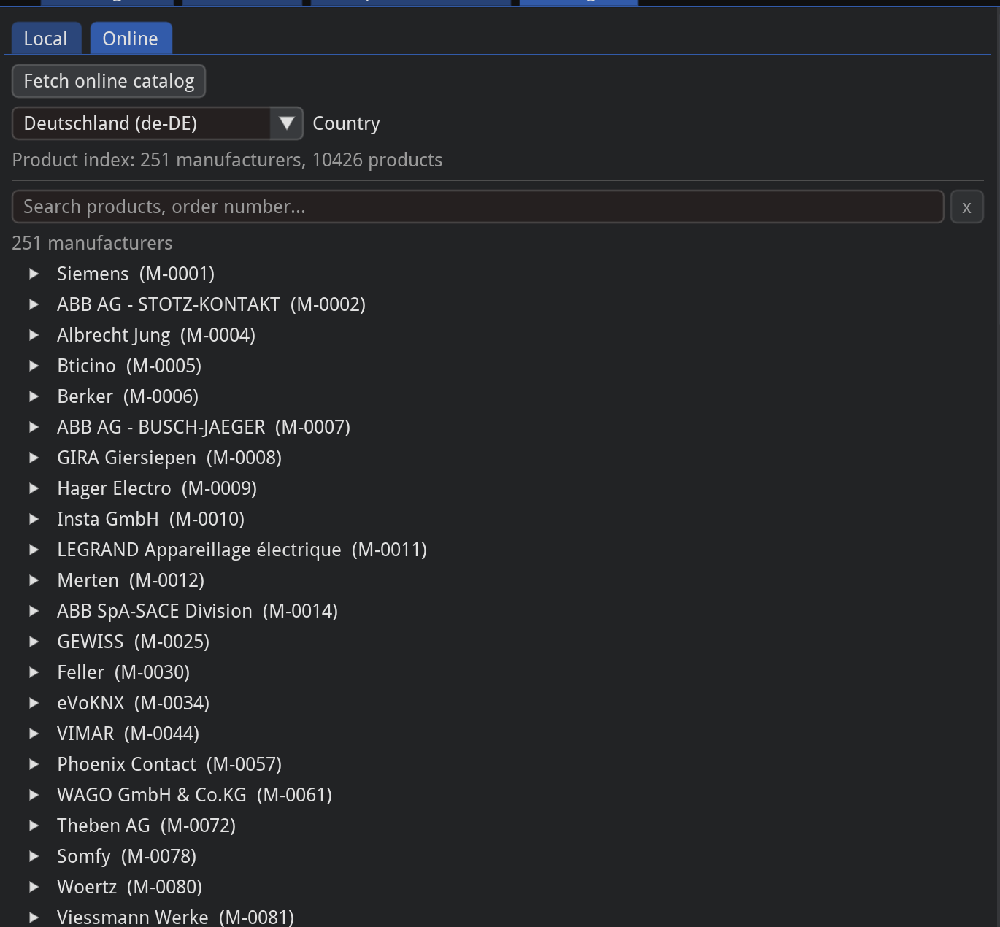
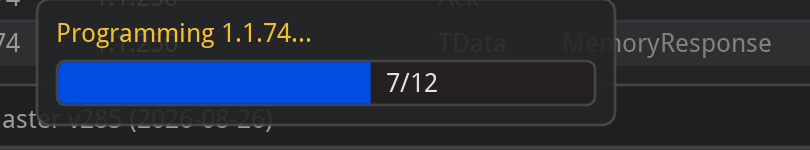
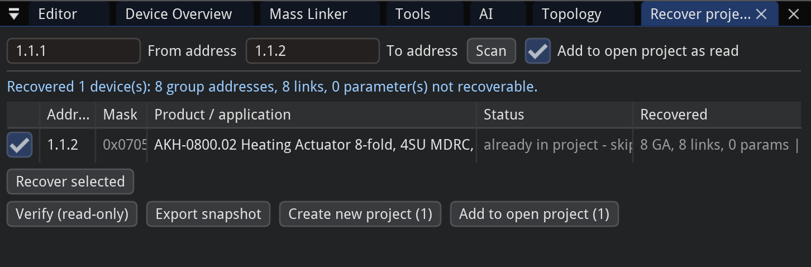
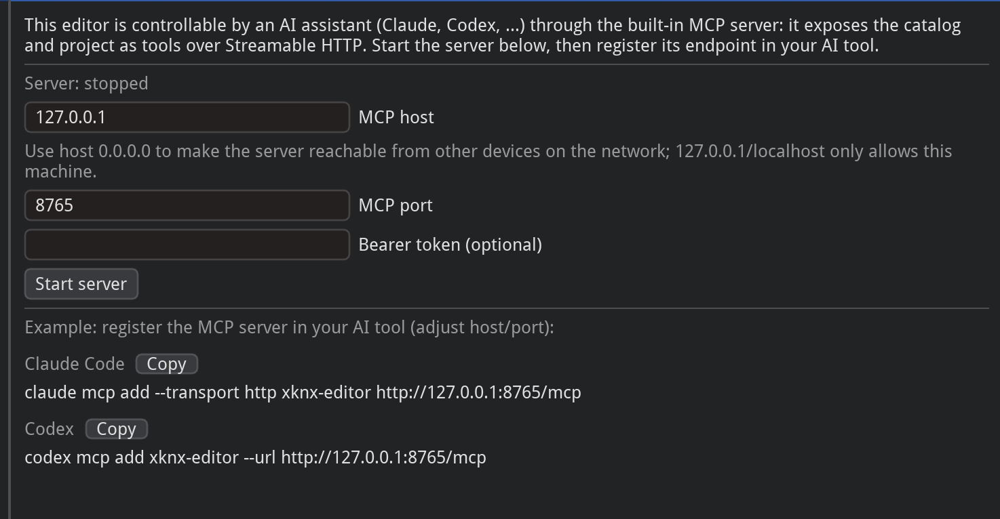

# XKNX Editor

XKNX Editor is a **multi-platform** desktop app (Windows, Linux, macOS) with native AI support for KNX building-automation projects based on KNX Standard Vol. 3, built on the open-source [xknx](https://github.com/XKNX/xknx)
library. Import and export `.knxproj` projects natively, browse product catalogs, **program KNX
devices** over a real bus, and drive it all through an **integrated MCP server for AI-assisted**
workflows which can auto download pdf manuals from the manufacturers.

## Download

Prebuilt apps for **Windows, Linux, and macOS** are attached to every release — grab the latest from
the [Releases page](https://github.com/knx-ai/xknx-editor/releases/latest) and start it directly.

On macOS the app is not signed by Apple yet, so the first launch is blocked:



To allow it, open it once, then go to **System Settings → Privacy & Security**, scroll down, and
click **Open Anyway** (confirm on the next launch). Alternatively, remove the quarantine flag in a
terminal:

```bash
xattr -dr com.apple.quarantine "/Applications/XKNX Editor.app"
```

## Features

<!-- Images are placeholders — replace the files in docs/images/ with real screenshots. -->

**Project editor** — a tree for the installation (topology, group addresses, buildings and rooms), a
detail table, and a properties panel. Communication objects are linked to group addresses with live
compatibility checks, and every change has full undo/redo.



**Import and export both work.** Open an existing project file and edit it, or export one that opens
in ETS. Exports bundle the required product data so the project is self-contained, are signed so ETS
accepts them, and are checked beforehand for anything missing from your catalog — so problems are
reported clearly instead of failing inside ETS.



**Product catalog** — import product files into a searchable catalog of manufacturers, hardware, and
applications, independent of any project, and drag entries in as new devices. You can also browse the
online catalog, cached locally for offline use.



**Programming real devices** — commission a device end-to-end over a live connection (tunneling or
routing, with gateway discovery), including setting a new device's address. A read-only **preflight**
and **Test Before Programming** read the device back and show the exact changes before anything is
written. Vendor-independent and verified on real hardware.



**Cockpit and health checks** — a site-wide device table with live status, plus a panel that flags
issues (missing or duplicate addresses, applications missing from the catalog, unlinked objects,
group addresses without a type or sender); click a finding to jump to the device.


**Network monitor and logs** — record and inspect bus traffic alongside a filterable application log;
with a project open, values are shown with the group address' name and decoded type.


**Recover from the bus** — reconstruct an installation without a project file by scanning an address
range and reading each device back read-only, then adding it to the project. Uncertain values are
marked rather than guessed, and a read-only verify diffs the result against the device. Still
maturing — review a recovered project before relying on it.



**MCP server (LLM control)** — an embedded [Model Context Protocol](https://modelcontextprotocol.io)
server lets an LLM drive the toolkit in the same live session as the GUI (shared project, catalog, and
connection). Start it from **Settings → MCP**. It can edit the project and program hardware, so only
expose it to clients you trust.



## Running from source

Only running from source is supported for now (developer-focused software).

```bash
uv sync
uv run python -m editor_gui.main
```

The app (distribution `xknx-editor`, import package `editor_gui`) is a workspace member the root
project depends on, so a plain `uv sync` installs it and its `imgui-bundle` dependency.

## Packages

Standalone, typed Python libraries (the `xknxmono` namespace), usable independently of the GUI:

| Package | Import | Description |
|---------|--------|-------------|
| `xknx-models` | `xknxmono.models` | XML schema bindings and version detection (foundation) |
| `xknx-product` | `xknxmono.product` | Reads and validates `.knxprod` product archives |
| `xknx-catalog` | `xknxmono.catalog` | Product catalog built from imported `.knxprod` archives |
| `xknx-project` | `xknxmono.project` | Project state management (incl. `.knxproj` import/export and offline signing) |
| `xknx-keyring` | `xknxmono.keyring` | Parses and serializes keyring XML (IP Secure keys) |
| `xknx-download` | `xknxmono.download` | Programs applications and individual addresses into real devices |
| `xknx-recover` | `xknxmono.recover` | Reconstructs a project by reading devices back from the bus |

```bash
pip install xknx-models xknx-product xknx-catalog xknx-project xknx-keyring xknx-download xknx-recover
```

## Development

```bash
uv sync                        # Install dependencies
uv run pytest                  # Run all tests (or: uv run pytest packages/models)
uv run ruff check              # Lint
uv run pyright                 # Type check
```

See `CLAUDE.md` and `apps/editor-gui/CLAUDE.md` for architecture notes and conventions.

To test unreleased `xknx` changes, clone it as a sibling and add a `[tool.uv.sources]` override in
`apps/editor-gui/pyproject.toml` (`xknx = { path = "../../../xknx", editable = true }`), then
`uv lock`; revert both files before committing.

## Requirements

- Python >= 3.13
- [uv](https://docs.astral.sh/uv/)

## Disclaimer

An independent, open-source project built on the [xknx](https://github.com/XKNX/xknx) library. **Not
affiliated with, endorsed by, or connected to** the KNX Association or its ETS software. "KNX" and
"ETS" are trademarks of the KNX Association, used here only to state this non-affiliation and to
describe interoperability with the published standard and file formats.
